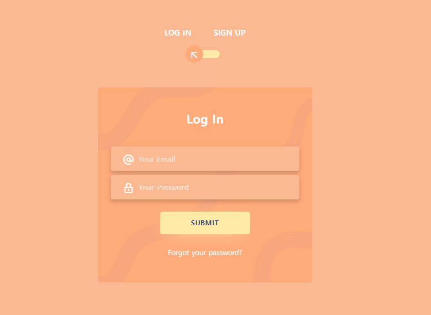
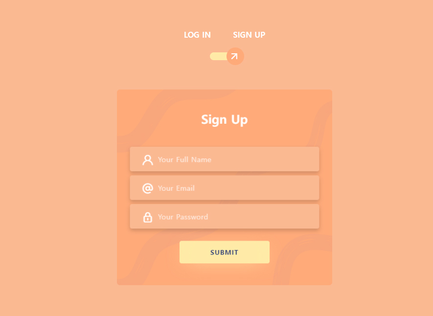
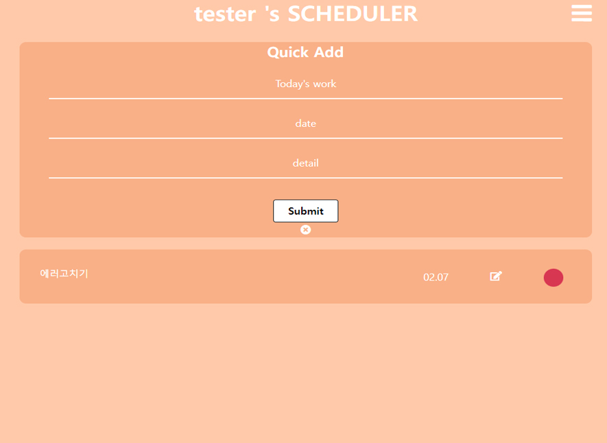

# 
  

# <a href="https://todoapp-340515.dt.r.appspot.com/login"> TodoApp 1.0.0 <a/> << Click to Check your Todo Lists!!!

   
  
## 기본 정보 
- Node.js와 Express, MongoDB를 활용하여 RESTFUL한 웹앱 제작 프로젝트. 서버와 DB연동을 통하여 CRUD Operation 구현하였으며, Login 기능과 회원가입 기능을 추가하여 이 앱을 사용하는 유저마다 각자의 TodoList를 볼 수 있도록 제작.

## 사용 예제
- 로그인 페이지  

  
  - 회원가입 페이지

  - 메인 페이지

  
 1. 로그인시 메인 페이지로 이동.
 2. Quick Add를 통해 할일 추가하기.
 3. 발행한 글의 오른쪽 문서 이모티콘 클릭시 글 수정 페이지로 이동하여 글 수정 가능.
 4. test 아이디로 Todo app 체험하기
      ID: test@naver.com 
     PW: test123 
  
  으로 로그인 후 체험가능.
    

## 업데이트 내역

* 1.0.0
    * 배포: Google Cloud platform을 통해 버전 1.0.0 배포.

